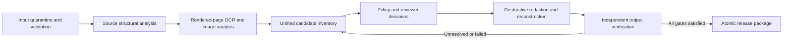

# PDF Sanitizer Production-Readiness Plan

*Revised 2026-08-01. This durable roadmap is paired with a dated, measured
current-state assessment. The architecture and phasing are unchanged; the
backlog and acceptance criteria now reflect verified implementation gaps.*

## Executive recommendation

Keep the current architecture, but change the definition of success.

The system is already good at destructively removing identifiers that it can
extract from a PDF text stream. The production-blocking weakness is that the
same page can contain visually readable text that is absent from that stream:
text embedded in an image, converted to outlines, hidden by unusual PDF object
structure, or exposed differently after flattening. The current verifier can
therefore report `PASS` while a person can still read an identifier.

There is a second blocking weakness, and as of today it is the one actually
biting: **a report can say `PASS` about a file that no longer exists in that
form.** Outputs, reports, denylist, lexicons, and code all move independently. Reports
record output hashes, but the workflow does not enforce them and records no
code or policy fingerprint, so it cannot determine whether an artifact remains
current. See the dated current-state assessment linked below — this is not a
hypothetical risk; it is the state measured on disk.

The next phase should focus on making a false pass structurally difficult:

1. Render and OCR every output page as an independent verification surface.
2. Make vector, raster, and verification paths use the same detection policy.
3. Bind every report to the exact code, configuration, models, and policy used.
4. Publish an output only after every required gate and review is complete.
5. Prove generalization on a deliberately varied, labelled PDF corpus.

This is an evolution of the existing system, not a rewrite. The destructive
redaction, PDF scrubbing, flattening, OCR reconstruction, denylist, lexicons,
and report model remain useful.

## Current-state evidence

The dated measurements and implementation findings now live in
[CURRENT-STATE-ASSESSMENT-2026-08-01.md](CURRENT-STATE-ASSESSMENT-2026-08-01.md)
so this plan can remain durable as files, hashes, and code change.

The assessment confirms:

- 40 unit tests pass and the 95-entry vocabulary policy set scores cleanly.
- That score is policy-vocabulary recall, not end-to-end document recall.
- Multiple current and historical reports coexist; some mismatch the PDFs and
  the hash-matching reports still lack code and policy provenance.
- Rendered-content verification, raster/vector parity, controlled failure
  behavior, review completeness, and artifact lifecycle remain open controls.
- The working tree is not under version control and has no CI release gate.

## What "production ready" should mean

No automated detector can honestly guarantee that it will find every possible
sensitive value in every future document. Production readiness should therefore
mean all of the following:

- No known sensitive value survives any supported test document.
- The system examines both the PDF structure and the final rendered pixels.
- Unsupported, ambiguous, truncated, or failed analysis produces `FAIL` or
  `REVIEW_REQUIRED`, never `PASS`.
- A report can prove exactly which policy and software produced its output.
- Outputs cannot be confused with artifacts from an older or failed run.
- Accuracy and preservation targets are measured on documents that were not
  used to tune the detectors.
- Project-intake capture is complete, or its incompleteness is explicit and
  signed off.
- A defined human review process handles uncertainty before release.
- Confidential inputs and derived review artifacts are isolated, access
  controlled, and deleted according to a retention policy.

The current `HUMAN_VISUAL_REVIEW_REQUIRED` status is the right default. It
should remain mandatory until the rendered-page verifier and a broad validation
corpus demonstrate enough reliability to justify a narrower review policy.

## Recommended production architecture

### 1. Input quarantine and validation

Treat every PDF as untrusted, even when it comes from a known customer or
partner.

- Accept only PDFs whose signature and parser-detected type agree.
- Assign an internal run ID and neutral filename immediately.
- Set explicit limits for file size, page count, rendered pixel count, object
  count, processing time, memory, and temporary disk usage.
- Detect encryption before page processing and return a controlled result that
  explains whether a password is required. *Today this is an uncaught
  `ValueError` traceback from line 2048 — fix in Phase 0.*
- Run PDF parsers, Ghostscript, barcode decoding, OCR, and ML inference in an
  isolated worker with no network, a read-only source mount, a writable
  per-run directory, and resource limits. *Every external process today runs
  without a timeout; `-dSAFER` on Ghostscript is the only isolation control
  present.*
- Never reuse an old output path as evidence of a new run.

This follows the defense-in-depth approach recommended by the
[OWASP File Upload Cheat Sheet](https://cheatsheetseries.owasp.org/cheatsheets/File_Upload_Cheat_Sheet.html): validate type and size, use generated filenames,
isolate storage, constrain permissions, and sandbox file processing.

### 2. Analyze both document structure and rendered pixels

Run two complementary analysis tracks on every page.

**Structural track**

- Extract words, blocks, reading order, annotations, forms, links, metadata,
  bookmarks, attachments, optional-content groups, JavaScript, and embedded
  files.
- Inspect every displayed image and its placement, not only repeated margin
  images.
- Record whether text is ordinary text, invisible text, outlined glyphs,
  raster content, or inaccessible to extraction.

**Rendered track**

- Render every page from the source at a documented OCR resolution.
- OCR the complete rendered page, including pages that already contain plenty
  of searchable text.
- Decode QR codes and barcodes from the rendered page.
- Optionally run targeted higher-resolution OCR on title blocks, stamps,
  seals, signatures, maps, and low-confidence regions.
- Preserve OCR coordinates so every finding maps back to pixels.

Rendered OCR is not just a fallback for scanned pages. It is the control that
detects content the PDF text extractor cannot see.

**Budget this honestly.** The baseline design adds at least one source-render
OCR pass and one final-output OCR pass per page; affected pages may require
additional post-redaction passes. Large-format sheets can exceed 100 million
pixels at 300 DPI, so pass count, DPI, tiling, concurrency, wall time, and peak
memory must be benchmarked rather than inferred. Define separate detection and
verification configurations, then require each to meet the locked-corpus recall
threshold. Verification may use a different engine or resolution when evidence
shows equal or better coverage; it must not be made cheaper without that
validation.

### 3. Build one unified candidate inventory

Every detection mechanism should produce the same internal record shape:

- Page and bounding boxes
- Category and proposed sensitive role
- Detector and detector version
- Keyed digest of the value; never the raw value, and prefer the digest over a
  masked shape in anything that travels (see Phase 5)
- Confidence and evidence
- Extraction surface: vector text, page OCR, embedded-image OCR, barcode,
  metadata, or document structure
- Policy decision and reason
- Reviewer disposition, if applicable

Candidate sources should include:

- Project-intake metadata and explicit denylist terms
- Deterministic patterns for contact details, locations, identifiers, paths,
  URLs, and credentials
- Layout-aware label/value detection across lines and blocks
- Local NER for people, organizations, projects, and locations
- OCR of full rendered pages and meaningful embedded images
- Barcodes, QR codes, maps, logos, seals, signatures, and configured regions
- Filename and document-property analysis

The denylist remains authoritative for known project values, but it must be
one source of recall rather than the only dependable source.

**And intake completeness deserves its own work item, not just a bullet.** The
denylist is the actuator: 36 terms produced roughly 2,490 exact redactions on
the reference corpus (the list now stands at 40), including a project number in
the footer of 1,002 of 1,475 pages. One more correct term outperforms almost
any detector improvement, and the data is sitting in the contract and the PM
system before the PDF is ever opened. Yet a run supplied with `--denylist` and
no `--project-metadata` is accepted silently, and nothing records which intake
fields were left empty. Fix that: require intake metadata (or an explicit
recorded waiver) for `RELEASED`, hash the intake file into the manifest, and
report the empty-field list as a review item.

### 4. Apply one policy on every processing surface

Vector detection, raster detection, post-flatten sweeping, and verification
must implement the same versioned policy specification. Production processing
may share policy code. The independent verifier should keep separate extraction,
rendering, OCR, and match-discovery plumbing, with parity tests proving that its
policy decisions remain equivalent.

That shared policy should define:

- Which categories are always sensitive
- Exact denylist precedence
- Allowlist and lexicon suppression
- Label-following-line behavior
- Table and schedule handling
- Minimum confidence and escalation rules
- Which decisions require a reviewer
- Which unsupported conditions force failure

Three of the four surfaces already share `candidate_suppression()`. The raster
surface does not — `ocr_detection_boxes()` (line 1428) takes no lexicons and
implements no label-following-line logic. Closing that gap is the whole of the
parity work, and it is a bug fix as much as a design change: the raster path's
fail-closed check currently aborts entire runs on noise the other three
surfaces are configured to ignore.

Add parity tests that feed equivalent content through vector text, scanned
images, mixed text/image pages, and final rendered OCR. Equivalent input must
produce equivalent candidate and policy decisions.

### 5. Redact and reconstruct

- Apply destructive vector redaction where reliable coordinates exist.
- If a sensitive value exists only in pixels or graphics, redact the pixels or
  rasterize the affected page.
- Rebuild rasterized pages from sanitized pixels and a text layer generated
  only from a second OCR pass over those sanitized pixels.
- Remove metadata, interactive objects, attachments, optional-content groups,
  thumbnails, hidden text, scripts, and unreachable objects.
- Run the post-flatten sweep using the same unified policy.
- Save only into the private per-run staging directory.

When coordinate confidence is too low, prefer redacting a larger region or
rasterizing the page over allowing a possible leak.

### 6. Verify the final artifact independently

The verifier is the most important production boundary. It should not merely
repeat the source detector over `page.get_text()` — which is exactly what
`verify_output()` does today.

For every final page:

1. Reopen the saved PDF in a fresh process.
2. Run structural checks for metadata, attachments, scripts, annotations,
   forms, links, layers, hidden objects, and unexpected page geometry.
3. Extract final searchable text and run the unified policy.
4. Render the final page using at least one renderer.
5. OCR that rendering and run the unified policy again.
6. Decode barcodes and QR codes from the final rendering.
7. Check that intended redaction regions are visually opaque.
8. Check for blank, corrupt, clipped, rotated, or materially changed pages.
9. Record every unresolved NER or low-confidence finding.

For the highest assurance tier, render with two independent engines or sample
with a second renderer. The goal is to avoid sharing the same parser blind spot
between sanitization and verification.

The following conditions must prevent `PASS`:

- Any residual deterministic or denylist match
- Any unresolved sensitive rendered-OCR match
- Any required detector that failed, timed out, or returned truncated results
- Any unresolved mandatory-review finding
- Missing or unverifiable policy provenance
- Page-count, page-size, render, or structural-cleanliness failure
- Any hard-coded check that was not actually performed

### 7. Publish one immutable release package

After all automated gates and required human decisions are complete, atomically
publish:

- Sanitized PDF
- Machine-readable report
- Human-readable review summary
- Run manifest
- Optional review-decision ledger

The run manifest should contain:

- Run ID and timestamps
- Source and output SHA-256 hashes
- Sanitizer commit identity when available, plus a source or build digest
- Denylist and project-metadata hashes, plus the list of empty intake fields
- Configuration, allowlist, and lexicon hashes
- OCR, PDF, barcode, NER model, Ghostscript, and dependency versions
- Detector configuration and thresholds
- Page counts and processing statistics
- Automated-gate results
- Review status, reviewer identity, and completion timestamp

Never overwrite a released package. A rerun creates a new run ID. A failed run
publishes a failure record but no releasable PDF. Note that today a
`PageProcessingError` returns exit code 3 **without writing any report at all**,
which is precisely how a nine-day-old `PASS` report ends up sitting beside a
freshly rewritten PDF.

## Work plan and exit criteria

### Phase 0 — Correct release semantics

**Goal:** prevent misleading output while deeper detector work continues.

Deliverables:

- **Define the source-controlled file set, repair `.gitignore`, then put the
  repository under version control.** Record commit identity when available and
  always compute a source/build digest. Add CI after initialization so the test
  suite becomes an enforced release gate.
- Replace the single `PASS` concept with `AUTOMATED_PASS`, `REVIEW_REQUIRED`,
  `REVIEW_INCOMPLETE`, `FAIL`, and `RELEASED`.
- Remove the hard-coded `raster_ocr_from_sanitized_images_only` check (line
  1991) — measure it or drop it.
- Grow `tools/verify_output_text.py` into the standalone `verify-existing`
  command: current policy, all detector families, report binding, and an exit
  contract. Keep its independent plumbing.
- Add policy and code fingerprints to the report — hashes of code, denylist,
  project metadata, config, allowlist, and each lexicon file.
- Stage results by run ID and publish atomically; write a failure record on
  every failed run, so no path leaves the previous report as the newest one.
- Fail controlled on encrypted input, before page 1.
- Add `timeout=` to every subprocess call with a fail-closed result.
- Quarantine or delete the current stale artifacts (see "Do this before the
  next implementation cycle").

Exit criteria:

- A changed denylist, detector, or config makes an old report explicitly stale.
- An encrypted, corrupt, interrupted, or failed run cannot expose a prior
  artifact as its result, and cannot produce a traceback.
- Only a completed release package may use `RELEASED`.
- Re-running `verify-existing` against the artifacts described in the dated
  current-state assessment reports them as stale and unreleasable, without a human
  comparing hashes by hand.

### Phase 1 — Close rendered-content blind spots

**Goal:** eliminate the proven class of false passes.

Deliverables:

- Full rendered-page OCR on every source and output page, at a documented
  resolution, with verification never cheaper than detection.
- OCR of embedded images or a documented whole-page equivalent.
- Replace the `min_text_chars = 20` searchable/scanned classification with one
  that accounts for raster content on text-bearing pages.
- Detection and redaction of outlined/non-extractable text.
- Targeted handling for title blocks, logos, seals, signatures, maps, and
  low-confidence OCR regions.
- Rendered-output barcode and QR verification.

Exit criteria:

- The mixed searchable-text/image leak test fails before remediation and passes
  only after the pixel content is destroyed.
- A fresh 43-page reference run contains no current-policy match in full-page
  rendered OCR.
- Every output page has a recorded rendered-verification result.
- Measured wall-clock and peak memory per page type are recorded for both
  reference documents, so Phase 6 capacity planning has real numbers.

### Phase 2 — Unify detection behavior

**Goal:** make format differences irrelevant to policy decisions.

Deliverables:

- One candidate record and one policy function for all surfaces; specifically,
  `ocr_detection_boxes()` gains `Lexicons`, `candidate_suppression()`, and
  label-following-line logic.
- Shared allowlist, lexicon, table, and boilerplate handling.
- Explicit language support and unsupported-language failure behavior. *Today
  Tesseract runs `-l eng`, the patterns are `[A-Z]`-anchored, and the address
  patterns are US-specific — an undocumented scope limit.*
- NER findings deduplicated into review decisions rather than occurrence noise
  *(done — surface-form dedup with occurrences, pages, score_max, zone)*.
- Replace the global `max_findings` cap with per-label caps, so low-volume
  high-value labels (`city`, `street address`) are not crowded out by
  `organization` volume.

Exit criteria:

- Vector, raster, mixed-page, and verification parity tests pass.
- No detector can silently skip because a dependency or model is unavailable.
- Truncated review results prevent completion — `residuals_truncated > 0` or
  `findings_truncated > 0` blocks `RELEASED` rather than merely being counted.
- A suppressible false positive on a rasterized page can no longer abort a run.

### Phase 3 — Build a generalization corpus

**Goal:** measure the system on documents it was not designed around.

Create three separated datasets:

- **Development corpus:** documents used while implementing detectors.
- **Validation corpus:** documents used for tuning thresholds and policy.
- **Locked release corpus:** never used for tuning; opened only for release
  qualification.

**The MLK Recreation Center corpus is a development corpus and can never be
promoted.** Every detector, lexicon entry, denylist term, and golden label in
the system was built against it. Its cleanliness measures fit, not
generalization. Write this down where someone tempted to reuse it will see it.

Include synthetic and permissioned real-world documents across:

| Dimension | Required cases |
|---|---|
| PDF construction | Searchable, scanned, mixed, outlined text, layered, malformed, encrypted |
| Layout | Title blocks, tables, forms, multi-column pages, rotated text, stamps, maps |
| Image quality | Low resolution, skew, noise, low contrast, handwriting, photographed pages |
| Sensitive content | People, firms, projects, addresses, contact data, account IDs, paths, signatures, barcodes |
| Negative content | Manufacturers, standards, technical schedules, model numbers, boilerplate |
| Placement | Headers, footers, body prose, images, metadata, attachments, annotations, hidden layers |
| Language | Explicitly supported languages and explicit failure for unsupported languages |

Every labelled item needs a bounding box, category, sensitivity decision, and
expected disposition — the step up in granularity from the current 95
string-level entries. Real identifiers can be replaced by representative
synthetic values when the layout rather than the value is what matters.

Exit criteria:

- Zero known false negatives on the locked must-redact set.
- Zero unexplained over-redactions on the locked must-survive set.
- Results are reported separately by document type, detection surface,
  category, language, and image quality—not only as one aggregate percentage.
- End-to-end document recall is reported as a distinct metric from
  policy-vocabulary recall, and nothing labels the latter as the former.
- All previously discovered leaks remain permanent regression tests.

### Phase 4 — Human review and learning loop

**Goal:** make uncertainty actionable and auditable.

Reviewer workflow:

1. Review a neutral list of candidate categories, pages, digests, and local
   crops.
2. Mark each finding as sensitive, safe, duplicate, or needs escalation.
3. Promote confirmed repeated identifiers into project metadata or the
   denylist.
4. Add confirmed general false positives to a scoped rule or shared lexicon.
5. Rerun the complete pipeline after any policy change.
6. Perform a final page-by-page visual review until evidence supports a more
   targeted review policy.
7. Record reviewer completion in the immutable release manifest.

Reviewer decisions must never modify global policy automatically. Changes to
shared lexicons or detector behavior require tests and normal code review.

Exit criteria:

- Every review finding has a disposition.
- No review list is truncated.
- Review decisions are tied to the exact output hash.
- Review crops are deleted or expired on a schedule, not left to a manual
  instruction in a README.
- Review time and disagreement rates are measured so detector improvements can
  target the most expensive uncertainty.

### Phase 5 — Operational and software security

**Goal:** make the processing environment safe and reproducible.

Deliverables:

- Private directories (`0700`) and files (`0600`) by default. *Currently a
  single `os.chmod` on the candidates file; outputs, reports, and 1,000 triage
  crops are `0644` under `0755` directories.*
- Encrypted storage where confidential documents persist.
- Automatic cleanup on success and startup recovery for abandoned runs,
  including triage crops.
- Explicit retention periods for sources, outputs, crops, and logs.
- No raw identifiers in ordinary logs; use keyed digests for correlation.
- **Default the report to keyed digests rather than masked shapes.**
  `masked_shape()` is a strict one-to-one character map, so a long span is
  partially reconstructable by matching shapes against the output text when
  report and PDF travel together. ANONYMIZATION.md documents this as a caveat;
  the format should remove the property instead of warning about it, and keep
  shapes only in the reviewer-local view.
- Process timeouts, memory/CPU/disk quotas, and controlled cancellation.
- Network-disabled workers and no public malware-scanning or OCR services.
  *The offline posture is already enforced in-process for the NER path
  (`HF_HUB_OFFLINE`, `local_files_only=True`) — extend that discipline to the
  worker boundary.*
- Locked dependencies with hashes, an SBOM, vulnerability scanning, and a
  documented upgrade process. *Currently range specifiers, no lockfile.*
- Reproducible builds and build provenance.
- Backups and restore tests for released manifests and authorized outputs.

Use [NIST SP 800-218 SSDF](https://csrc.nist.gov/pubs/sp/800/218/final) as the
software-development baseline: define security requirements, protect source
and build integrity, verify third-party components, test security behavior,
and maintain a vulnerability-response process. Pillow's own
[security guidance](https://pillow.readthedocs.io/en/stable/handbook/security.html)
also recommends hash-pinned dependencies, explicit metadata handling, and
controls for decompression bombs and temporary files.

Exit criteria:

- A clean machine can reproduce a run from its manifest.
- Dependency and container scans meet the team's documented severity policy.
- Resource-exhaustion and malicious-file tests fail safely.
- No confidential artifact is readable outside its authorized account or
  service identity.

### Phase 6 — Controlled pilot and production launch

**Goal:** validate the complete operating process before broad use.

Pilot sequence:

1. Shadow mode on non-confidential documents.
2. Permissioned confidential pilot with mandatory full visual review.
3. Compare all automated findings, reviewer catches, misses, and
   over-redactions.
4. Conduct a formal go/no-go review against the checklist below.
5. Start production with limited users, document types, languages, and volume.
6. Expand scope only after each new category passes the locked corpus and pilot
   review.

Production should retain kill switches for a detector, model, document type,
or dependency version without allowing affected runs to pass silently.

## Production go/no-go checklist

Do not launch until every item is true:

- [ ] Source is under version control, and every release manifest names a
      specific commit.
- [ ] The licensing posture is decided and documented for the actual
      deployment shape (see "Open decisions").
- [ ] Every output page is independently rendered and OCR-verified.
- [ ] Mixed text/image and outlined-text leak tests pass.
- [ ] Vector, raster, and verifier policy-parity tests pass.
- [ ] No known false negative remains in the locked release corpus.
- [ ] End-to-end document recall is measured and reported separately from
      policy-vocabulary recall.
- [ ] Over-redaction is within the documented acceptance threshold for every
      supported document category.
- [ ] Detector failures, timeouts, unavailable models, and truncation fail
      closed.
- [ ] No external process can run without a timeout.
- [ ] Encrypted, corrupt, and oversized inputs produce a controlled result,
      never a traceback.
- [ ] Project-intake metadata is complete and hashed into the manifest, or an
      explicit waiver is recorded.
- [ ] Reports include complete policy, code, model, tool, and dependency
      provenance.
- [ ] Outputs and reports publish atomically under immutable run IDs.
- [ ] Human review is complete and bound to the released output hash.
- [ ] File permissions, encryption, retention, and cleanup controls are tested,
      including automatic expiry of review crops.
- [ ] Untrusted-file processing is isolated and resource constrained.
- [ ] Dependencies are locked, hash verified, scanned, and represented in an
      SBOM.
- [ ] Operational monitoring detects failures, latency regressions, cleanup
      failures, and review backlogs without logging raw sensitive values.
- [ ] Incident response, rollback, and reprocessing procedures have been
      rehearsed.

## Do this before the next implementation cycle

These are development-hygiene and provenance tasks. The current fixtures are
non-confidential, but the workflow should be safe before confidential inputs
arrive.

1. Define the source-controlled file set. Update `.gitignore` to exclude the
   complete output and temporary trees, local policy files, generated crops,
   virtual environments, model weights or caches, and any corpus files not
   intentionally versioned.
2. Initialize Git, inspect `git status` before staging, then commit only the
   intended code, safe configuration, tests, and documentation. Add CI so the
   unit and policy-vocabulary suites become enforced gates.
3. Delete or archive completed review crops and retired outputs according to a
   documented development retention rule. Do not treat filenames as proof of
   currency.
4. Use private directory and file modes now as a rehearsal for Phase 5, even
   though the current fixtures are non-confidential.
5. Do not cite another reference run as evidence until the rendered-OCR
   verifier and artifact-binding checks exist.

## Immediate engineering backlog

Recommended implementation order:

0. **P0 — Source provenance and CI.** Define the tracked file set, repair
   ignores, initialize version control, record a build digest, and enforce the
   test suites in CI.
1. **P0 — Final rendered-page OCR verifier.** Make this fail the current
   reference output before implementing the remediation.
2. **P0 — Mixed-page remediation.** Redact sensitive rendered regions or
   rasterize affected pages, then prove the rendered verifier is clean.
   Includes replacing the `min_text_chars` classification.
3. **P0 — Raster/vector parity.** Share label-following-line, suppression, and
   candidate logic; stop a suppressible false positive from aborting a run.
4. **P0 — Policy fingerprint and `verify-existing`.** Grow
   `tools/verify_output_text.py`; make stale reports detectable by the tool
   rather than by hand.
5. **P0 — Atomic run packaging.** Eliminate stale output/report ambiguity;
   write a failure record on every failed run.
6. **P0 — Fail-closed input handling.** Controlled encrypted-PDF result,
   subprocess timeouts, remove the hard-coded check.
7. **P1 — Generalization corpus and regression suite.** Separate development,
   validation, and locked release data; move labels from strings to pages.
8. **P1 — Review-completeness gate.** Unresolved or truncated NER findings
   cannot be represented as complete; per-label caps.
9. **P1 — Intake-completeness gate.** Require and hash project metadata;
   report empty fields.
10. **P1 — Private artifact handling.** Permissions, retention, cleanup, safe
    logs, keyed digests in reports, protected review crops.
11. **P1 — Worker isolation and resource limits.** Harden untrusted PDF and
    image processing.
12. **P2 — Performance optimization.** Only after the full verification path
    is correct, optimize OCR resolution, region targeting, caching, and
    parallelism without weakening the release gate.

Items 0 and 6 are new in this revision. Estimate them only after the tracked
file set, CI environment, timeout policy, and encrypted-input behavior are
specified.

## Open decisions blocking benchmark qualification

These are product, policy, or legal decisions rather than detector
implementation tasks.

1. **The ambiguous architect-of-record case.** The 2026-07-31 NER triage found
   a full firm name plus city/state surviving in cleartext in the sanitized
   specs output, and could not determine whether that is an intentional
   architect-of-record disclosure — common on stamped drawings — or a denylist
   gap. Until this is settled the reference output cannot qualify as benchmark
   evidence, and the answer changes what the locked corpus should label.
2. **Licensing posture.** PyMuPDF and Ghostscript use AGPL/commercial licensing
   models. The obligations depend on the exact deployment, modifications,
   distribution, and remote-user interaction. Possible paths include complying
   with the applicable open-source terms, obtaining commercial licenses, or
   changing components. Document the intended deployment and obtain qualified
   legal review before launch; do not treat this plan as legal advice. See the
   [GNU licensing FAQ](https://www.gnu.org/licenses/gpl-faq.en.html) and
   [AGPL text](https://www.gnu.org/licenses/agpl.en.html) for the source-offer
   and internal-copy distinctions.
3. **NER review qualification.** Track re-triage after leak fixes and any
   proposed label or inference-API experiments as explicit tickets with a
   hypothesis, benchmark, and acceptance criterion. They block benchmark
   qualification only if the selected review workflow depends on them.

## Metrics to track from the first pilot

- Recall by identifier category and detection surface
- Over-redaction by technical-content category
- Rendered-OCR residuals found after structural verification passed
- Reviewer-only catches
- Reviewer disagreement rate
- Unresolved and truncated findings
- Pages rasterized and reason
- Processing time and peak memory per page type
- Failures, timeouts, and abandoned-run cleanup
- Average reviewer minutes per 100 pages
- Reprocessing rate after policy changes

These metrics should be recorded without raw sensitive values. The most useful
production metric is not the total number of redactions; it is the number and
type of findings discovered by a later layer that an earlier layer missed.

## Final recommendation

Focus the next engineering cycle on backlog items 0 through 6. Do not spend
that cycle tuning more regexes or optimizing NER thresholds.

The 2026-07-31 plan named one production blocker: a visually readable
identifier can survive while the system reports success. That is still true and
still first. Today's measurements added a second, and it is cheaper to fix and
currently doing more damage: **the workflow cannot automatically prove that a
report applies to the current file under a path or to the current policy.** Nine
days of divergence between code, policy, outputs, and reports produced a green
`PASS` for two byte sequences that no longer exist at the reported output
paths, while the normal workflow supplied no automatic stale-artifact gate.

Both blockers are the same problem wearing different clothes — the trust
boundary is unenforced. Once final rendered-page verification, policy parity,
provenance, and atomic release semantics are in place, detector coverage can be
expanded safely and measured against a generalization corpus.
